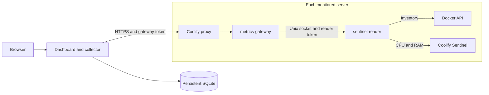

# Sentinel Dashboard

[](LICENSE)


**CPU, memory, and historical metrics for your Coolify infrastructure, in one dashboard.**

Monitor multiple servers, find applications consuming resources, and configure
alerts for sustained high usage. The dashboard reads metrics already collected
by Coolify Sentinel through authenticated HTTPS gateways and stores history in SQLite.

Run it with Docker Compose on a workstation or a private server. Collection
continues when the browser is closed. Python uses only the standard library,
and the frontend needs no build step.

The interface supports **English and Italian**, light and dark themes, keyboard
navigation, and status descriptions that do not rely on color alone.

**[Quick start](#quick-start)** · **[Connect servers](#connect-a-coolify-server)** ·
**[Server deployment](#deploy-the-dashboard-on-a-private-server)** ·
**[Language](#language)** · **[Alerts](#alerts)** ·
**[Troubleshooting](#troubleshooting)** · **[Contributing](#development-and-testing)**

## Features

| | What you get |
| --- | --- |
| **Overview** | Server CPU and RAM percentages, high-usage highlighting, and sample timestamps. |
| **Details** | Per-server and per-resource charts, application inventory, and project navigation. |
| **History** | Recent samples and long-term aggregates in SQLite, with recovery after collection gaps. |
| **Alerts** | Configurable thresholds and duration, visual alerts, sound, browser notifications, and Do not disturb. |
| **Collection** | One authenticated HTTPS gateway per server, with no SSH connections from the collector. |
| **Honest data states** | Fresh, stale, and unavailable readings; missing samples remain gaps in charts. |
| **Two languages** | English and Italian labels, messages, charts, and locale-aware dates and numbers. |

## Quick start

Requires **Docker with Docker Compose**. After downloading or cloning this
repository, run the following commands from its directory for a first installation:

```sh
mkdir -p secrets
cp config/servers.example.json config/servers.json
cp secrets/dashboard.env.example secrets/dashboard.env
chmod 600 secrets/dashboard.env
docker compose up -d --build
```

Open http://localhost:3090. The example server starts disabled. Enable it only
after configuring a gateway and its token. The dashboard does not populate
production views with simulated data.

To receive metrics, you need at least one Linux server managed by Coolify with
Sentinel and metric collection enabled. You do not need Python or Node.js
installed on your workstation to run the Docker version.

The local port binds to `127.0.0.1` only. The Docker volume `metrics-data` keeps
SQLite data when the container is recreated. Use `docker compose stop dashboard`
to stop collection without deleting data. Avoid `docker compose down -v` if
you want to preserve history.

## Connect a Coolify server

1. Verify that Sentinel and metric collection are enabled on the Linux server.
2. Create a Docker Compose resource in Coolify on the server and project of your choice.
3. Paste `deploy/coolify-gateway-portable.yaml`. Assign an HTTPS domain to
   **metrics-gateway only**, using internal port `8080`.
4. Coolify generates `SERVICE_PASSWORD_64_READER` and `SERVICE_PASSWORD_64_GATEWAY`.
   Copy the second value into `secrets/dashboard.env`, using a separate variable
   for each server, such as `METRICS_GATEWAY_SERVER_01`.
5. Add an entry to `config/servers.json`: a stable, unique `id`, a display name,
   the gateway's HTTPS origin in `url`, its environment variable name in
   `token_env`, and `enabled: true`. Do not put the token value in JSON.
6. Set `sentinel_retention_days` to match the history available on that server.
7. Run `docker compose up -d --force-recreate` to load the configuration and
   credentials. Check inventory and sample timestamps as well as healthchecks.

Example `config/servers.json` for an already configured gateway:

```json
{
  "poll_seconds": 30,
  "retention_days": 90,
  "servers": [
    {
      "id": "server-01",
      "name": "Example server",
      "enabled": true,
      "url": "https://metrics.example.com",
      "token_env": "METRICS_GATEWAY_SERVER_01",
      "sentinel_retention_days": 7
    }
  ]
}
```

Add `METRICS_GATEWAY_SERVER_01` to `secrets/dashboard.env` with the value generated
in Coolify. To connect more servers, add one JSON entry and environment variable
per gateway. The domains in these examples are placeholders.

| Setting | Meaning |
| --- | --- |
| `id` | Stable local server identity. Keep it unchanged to retain its association with historical data. |
| `url` | Gateway HTTPS origin, without paths, query strings, or embedded credentials. |
| `token_env` | Name of the environment variable containing the gateway token. |
| `poll_seconds` | Desired collection interval, with a minimum of 15 seconds. |
| `retention_days` | Local aggregate retention, from 7 to 365 days. |
| `sentinel_retention_days` | History available at the source, up to 7 days. |

The gateway requires HTTPS with a valid certificate. For a private certificate
authority, configure `ca_file` with the path to its certificate mounted inside
the container, for example under `/run/secrets`. Redirects are not followed,
and TLS verification remains enabled.

The portable template embeds the Python source as non-secret configuration,
avoiding dependencies on the permissions of files generated by Coolify.
`deploy/coolify-gateway.yaml` is an alternative using Coolify's `volumes.content`
extension; it is not intended to run directly on a workstation. It requires
separate `METRICS_GATEWAY_TOKEN` and `METRICS_READER_TOKEN` values. It does not use
`configs.content`, which is incompatible with some read-only deployment configurations.

## Deploy the dashboard on a private server

Use a **Git-based Application** in Coolify to build the dashboard from this
repository and deploy automatically on pushes to `main`. Prepare these host
directories under `/var/coolify/coolify-dashboard`:

| Directory | Contents | Mount |
| --- | --- | --- |
| `config` | Your actual `servers.json` | `/config`, read only |
| `secrets` | `dashboard.env` and any private CA certificates | `/run/secrets`, read only |
| `data` | SQLite database, WAL, and SHM files | `/data`, writable |

Transfer configuration and secrets through a private channel and allow the
container user, UID/GID `10001:10001`, to read
the mounted files and write the data directory. Restrict access to data and
secrets. Docker Compose reads the `.env` file on the host.

To migrate an active database, use SQLite's `backup` API. Do not copy just the
database file while WAL writes are in progress.

1. In Coolify, create an application using **Private Repository (with GitHub
   App)**. This option also supports public repositories. Select your GitHub
   integration, this repository, and branch `main`.
2. Select **Docker Compose**, base directory `/`, and Compose location
   `/compose.coolify.yaml`. Load the Compose file from the repository.
3. Set the runtime variable `DASHBOARD_ALLOWED_HOSTS` to your dashboard hostname
   (without the scheme or port), and set the `dashboard` service domain with
   internal port `3090`, for example `https://dashboard.example.com:3090`.
4. Enable **Auto Deploy** and deploy. Verify a subsequent push to `main` creates
   a deployment for that commit. The GitHub App webhook must be reachable by
   GitHub; the dashboard itself can remain private.

Coolify builds the root `Dockerfile` from the selected commit. Application code
is part of the image; do not mount a host directory over `/app`, as that would
hide the newly built code. Configuration, credentials and the SQLite database
stay in the persistent host folders. The dashboard publishes no host port;
Coolify's proxy connects to the container.

When migrating from the standalone Compose service, stop the old service before
starting the Git application against the same database. Reuse the existing
domain and host folders, and keep only one collector running against that database.
Changing the resource in Coolify does not require a database migration.

`deploy/coolify-dashboard.yaml` remains available as a standalone Compose
example with manually transferred source files in an `app` folder. It does not
provide automatic Git deployments; use `compose.coolify.yaml` for that workflow.

The dashboard **does not include a login**. Keep it behind a private network/VPN
or an authenticating proxy. Host validation limits allowed names; it does not
replace authentication. Only localhost and 127.0.0.1 are accepted by default.
Explicitly configure additional names in `DASHBOARD_ALLOWED_HOSTS`.

## Architecture and access boundaries



The reader uses Linux host networking and listens only on a shared Unix socket.
The gateway does not mount the Docker socket. The only authenticated gateway
endpoints are `GET /v1/inventory` and `GET /v1/history`; `/health` reports process
health. There are no deployment, command execution, or generic proxy endpoints.

The reader mounts the Docker socket: **a `:ro` mount does not make the Docker
API read only**. The code permits only two specific GET requests, but the
process remains trusted. A compromised reader could gain access to the daemon.
Credentials and environment variables are not returned to the browser.

## History and interpreting metrics

- The default polling interval is 30 seconds, with four concurrent requests per
  server. A slow cycle can take longer; other servers continue independently.
  Historical recovery uses two workers and one-hour chunks.
- Raw samples are kept for seven days, followed by five-minute aggregates up to
  the configured retention period, 90 days by default. Averages, minima, maxima,
  and sample counts are preserved.
- Recovery is limited to history still available in Sentinel, up to seven days.
  The browser may be closed during collection; the collector must remain running.
- Server CPU is a percentage of the host total. Container CPU can exceed 100%
  when using multiple cores. Resource memory is displayed in MiB/GiB.
- Coolify labels associate sources with applications. Redeployments with stable
  identities retain their history, and replicas are aggregated. Sources sharing
  the same Sentinel key cannot be distinguished downstream.
- Inventory and metric availability are separate. Resources without samples
  remain unavailable; missing samples are not converted to zero.
- A container created and removed entirely during a collection outage may not be
  discoverable. Build servers, Swarm, and custom Sentinel networks require
  individual compatibility checks.
- Timestamps are stored in UTC and displayed in the browser's time zone.
  SQLite uses WAL and `synchronous=NORMAL`: a power failure can lose the latest
  local samples, which can be recovered while they remain available in Sentinel.

## Language

Use the **Italiano / English** selector in the header to switch languages instantly.

On your first visit, the dashboard uses the first supported language in your
browser preferences, falling back to English. An explicit choice is saved in
this browser and synchronized across tabs on the same origin. If storage is
blocked, language switching still works for the current tab.

The language controls labels, status messages, errors, chart descriptions,
browser notification text, numbers, and dates. It does not change your time zone,
resource names, selected server, search filters, or unsaved alert form values.
Language preferences are separate from existing alert settings.

Translations are maintained in `dist/i18n.js`. Italian source messages are
paired with English translations; interpolation keeps resource names separate
from translated copy.

## Alerts

Open **Alerts** to configure CPU/RAM thresholds and a minimum duration. Defaults
are 80% for 30 seconds on servers. Up to 20 specific rules are supported;
application memory thresholds use MiB. Alerts repeat every five minutes.

Do not disturb defaults to 00:00–06:00 in the browser's time zone, with editable
hours and a manual override. It keeps visual alerts while muting notifications
and sound. Missing or stale data suspends evaluation.

Click **Enable notifications and audio** after opening the page. Native browser
notifications require a secure context, HTTPS or localhost, and browser permission.
On an HTTP domain, visual alerts and sound remain available through **Enable audio**.

These are not Web Push notifications: a tab must remain open and the device must
be awake. Background timers may be delayed. Preferences and delivery cadence are
stored per browser and origin; changing the domain does not transfer them.

| Default | Behavior |
| --- | --- |
| Server CPU / RAM: **80%** | Immediate sidebar highlighting; alerts also evaluate duration. |
| Duration: **30 seconds** | The threshold must remain exceeded across available samples. |
| Repeat: **5 minutes** | Another alert while high usage continues. |
| Do not disturb: **00:00–06:00** | Mutes sound and notifications while keeping visual alerts. |

## Troubleshooting

| Symptom | What to check |
| --- | --- |
| No server configured | Check `config/servers.json` and `enabled: true`; the example server starts disabled. |
| Gateway unreachable | Check DNS, network access, the HTTPS domain, and its certificate. Configure `ca_file` for a private CA. |
| Authentication failed | Use the **gateway** password, not the reader or Sentinel token. Recreate the container after changing environment variables. |
| Server visible, application data missing | Sentinel may not collect samples for that resource. Docker inventory does not guarantee metric coverage. |
| Stale samples after an outage | Allow time for historical recovery. Samples already deleted by Sentinel cannot be recovered. |
| Dashboard rejected on a private domain | Check `DASHBOARD_ALLOWED_HOSTS` and internal port 3090 in the proxy. |
| No sound | Enable audio in the current tab, check Do not disturb, and keep the device awake. |
| No browser notifications | Check secure context, browser permission, and Do not disturb. Notifications are unavailable on an HTTP domain. |
| Language choice is not remembered | Allow browser storage. The current tab can still switch languages without saving the preference. |

To inspect the local process, run `docker compose ps` and
`docker compose logs --tail=100 dashboard`. Remove resource names, domains,
and other infrastructure details before sharing logs or screenshots.

## Development and testing

Tests require Python 3.13, Node.js, and OpenSSL. Docker Compose is needed only
for template validation.

```sh
python3 -m unittest discover -s tests -v
node --check dist/app.js
node --check dist/i18n.js
node --test tests/*.test.cjs
docker compose config --quiet
python3 deploy/check-compose.py
```

Tests use fixtures and temporary certificates. They do not contact production
servers. For an isolated browser preview with clearly synthetic data, run
`python3 tests/ui_fixture.py` and open http://localhost:3091.

`deploy/gateway-service.py` contains functions shared with `service.py`, with
an entry point restricted to reader/gateway roles. Tests compare Python
definitions and the source embedded in both gateway templates; keep them in sync.

Collector changes should preserve the separation between live collection and
historical recovery. Frontend and alert changes should preserve missing-data
states, accessibility, and Do not disturb. Describe the problem and relevant
checks in contributions, using fictional examples.

Localization tests cover language selection, persistence, number formatting,
error messages, placeholders, and static HTML/accessibility copy. Check both
languages in the browser when adding or changing interface text.

## Private files and publishing

`.gitignore` excludes actual configuration, credentials, databases, archives,
and `private/`, which is reserved for local deployment configurations and records.
Examples contain fictional names and values only.

Do not share an archive of the entire working directory: Git exclusions do not
apply to manually created ZIP files. Check the actual files and Git history
before publishing.

## License

Distributed under the [MIT License](LICENSE). This is an independent project,
not an official Coolify product. External components remain subject to their
respective licenses.

## References

- [Sentinel API](https://github.com/coollabsio/sentinel/blob/main/API.md)
- [Starting Sentinel in Coolify](https://github.com/coollabsio/coolify/blob/v4.x/app/Actions/Server/StartSentinel.php)
- [Coolify documentation](https://coolify.io/docs)
- [Docker host networking](https://docs.docker.com/engine/network/drivers/host/)
